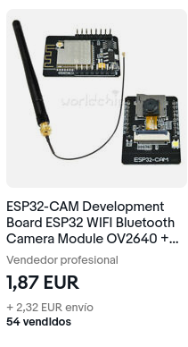

# Introduction

This repository contains materials for a workshop titled:

"AI on the Edge"

which is intended to give a brief technical introduction to issues surrounding
edge based AI. The duration is estimated at roughly 2 hours.

Prerequisites are:
	
- a rough understanding of AI terminology: terms such as face detection,
  neural network, TensorFlow, model should not be entirely foreign

- a bit of programming experience. You know what a loop and an IF
  statement is. Ideally you have programmed an embedded system such as
  Arduino

- not feeling too uncomfortable working in a terminal environment and
  with command line tools

- general common sense. It helps to know your way around your laptop.


## How We Will Proceed

Depending on the number of participants, we won't have enough time to actually
install tools to develop the firmware on everyone's laptop. We will demonstrate
all the necessary steps to do so, though. After completing the workshop
participants should be able to hold the workshop themselves (and are allowed
and encouraged to do so). If you have some experience as a software
developer, we expect you will be able to follow along. Depending on how well
the Wifi works. 

In case you require assistance installing the tools we use in the
workshop, we will be available afterwards to help set everything up on
your computer.

## The Hardware.

The necessary hardware for the workshop is:



- an ESP32-CAM module : a very cheap system consisting of a Wifi
  capable CPU, camera sensor, SD Card slot and support board for USB
  connectivity
- a micro USB cable
- a laptop, preferably Linux or Mac


## Prerequisite Tools

The laptop used to build the firmware for the ESP32-CAM module requires
a number of standard software development tools, which, depending on the
audience is either already installed or unheard of: `git`, `python`
(3), `cmake`, etc.

Go to the ESP-IDF [Getting
Started](https://docs.espressif.com/projects/esp-idf/en/v4.4.1/esp32/get-started/index.html)
page for instructions on how to install for:

- [Mac](https://docs.espressif.com/projects/esp-idf/en/v4.4.1/esp32/get-started/macos-setup.html)
- [Linux](https://docs.espressif.com/projects/esp-idf/en/v4.4.1/esp32/get-started/linux-setup.html)
- [Windows](https://docs.espressif.com/projects/esp-idf/en/v4.4.1/esp32/get-started/windows-setup.html)

We will skip this step.

## The IDF

Espressif, the supplier of the chip running on the ESP-CAM, provides the
so called IDF (IoT Development Framework). If you have worked with
embedded before: This is their SDK, which encompasses a simple but robust build
system, compilers and other tools required to build the firmware as well as a
number of libraries useful for building simple Wifi powered devices.

From here on, we will mainly be working in terminals ...

```bash

# Create a directory to install the IDF in
$ mkdir espcamworkshop
$ cd espcamworkshop

# grab a copy of the IDF and dependencies, this takes ~ 3 min
$ git clone -b v4.4.1 --recursive https://github.com/espressif/esp-idf.git

# the IDF contains tools to download and install compilers, etc.
$ cd esp-idf
$ ./install.sh        # this takes ~ 30 s

# finally, update $PATH and set further environment variables to point
# to the proper compiler versions, etc. These changes are only in effect
# as long as the terminal is open

$ source ./export.sh

```

If you already connected your module to your computer via USB, you
should be able to run:

```bash
$ esptool.py chip_id
...
Chip is ESP32-D0WDQ6 (revision 1)
Features: WiFi, BT, Dual Core, 240MHz, VRef calibration in efuse, Coding Scheme None
Crystal is 40MHz
...
```

If the `esptool.py` command searches for the ESP-CAM device but does not find
it, you can provide a hint to the command concerning the correct serial port
(e.g. by running `esptool.py --port <your serial port> chip_id`),

## This Repository

Next, you will need to clone a copy of this repository to your computer.
Depending on where you are reading this, you may have already done so. If
not, clone this repository:

```bash
$ cd espcamworkshop
$ git clone --recursive git@github.com:presseverykey/esp32cam-nn-example.git

# if you already cloned the repo, but did not use the `--recursive` flag,
# you will need to execute:

$ git submodule update --recursive

```

We should be ready to build the software now!

```bash
# This step can take up to 5 min!
# ... and if you are a stickler about clean code, expect
# to see some compiler warnings from tensorflow ...
$ cd esp32cam-nn-example.git
$ idf.py build
...
Project build complete. To flash, run this command:                                                      
...
or run 'idf.py -p (PORT) flash'

# Naming a port is not necessary on some machines...

$ idf.py flash

# Now have a look at the logs:

$ idf.py monitor
```


## The Functionality

The firmware functionality is as reduced as possible to facilitate
explaining how everything works. In general:

- the camera acquires a picture into a framebuffer
- each framebuffer is fed into a model
- the model calculates the probability that the picture contains a face
- in case a probability threshold is exceeded the onboard LED is turned
  on
- the current framebuffer may be retrieved via http

### Files and Directories

- `components` : contains libraries to control the camera, execute
  tensorflow-lite models and esp specific AI optimization routines.
- `main` : the firmware, we will look at the following files in `main`
  more closely:
  - `main.cpp` : this is where everything comes together. Start here.
  - `camera.cpp` : contains initialization code for the camera
  - `network.cpp` : code to setup a wifi access point to connect to
  - `ai.cpp` : code to setup and interact with tensorflow
  - `person_detect_model_data.cc` : this contains the actual model we'll be executing


### Examining the Model

The final step examining the firmware is to have a closer look at the
model underlying the person detection. Since we will just gloss over how
models are created and optimized and quantized down to lite models, we
will NOT use Tensorflow tools to examine the models. Installing
Tensorflow is a workshop in itself.

We recommend:

- [tflite-tools](https://github.com/eliberis/tflite-tools) : requires
  python & download
- [Netron](https://netron.app/) : online or
  [offline](https://github.com/lutzroeder/netron)

You can extract the model from `person_detect_model_data.cc` by deleting
all the C code from the top and bottom of the file, and running:

```
$ xxd -r -p person_detect_model_data.notcc > person_detect.tflite
```


